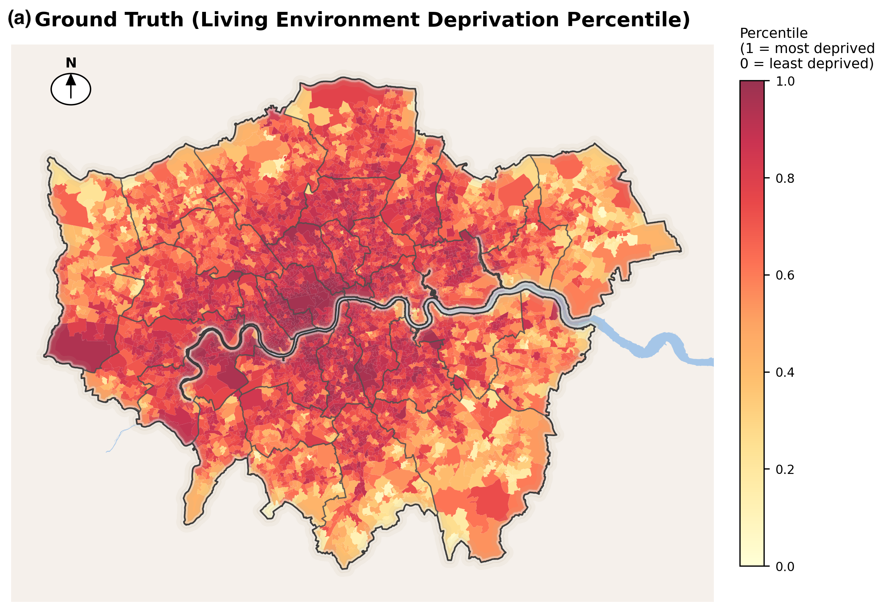
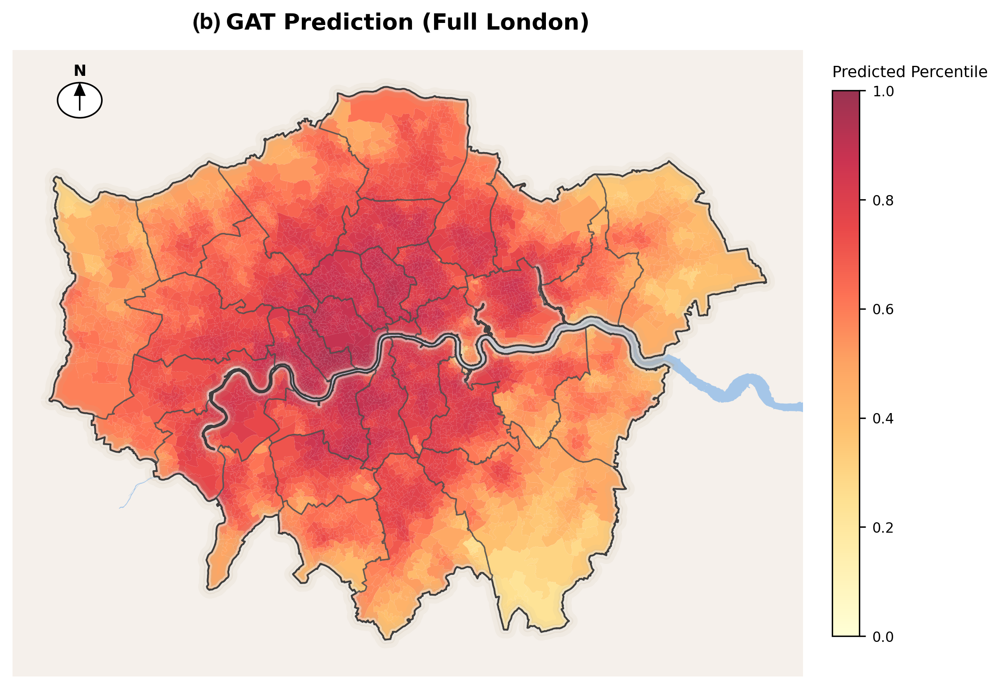
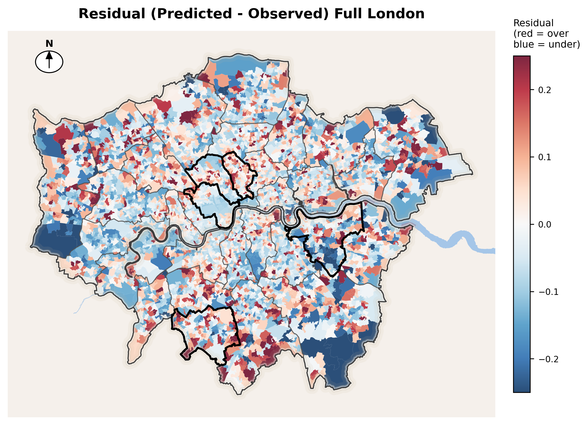

# GeoAI London Living Environment Analysis

Portfolio-ready version of a GeoAI project on living environment deprivation in London, prepared for job and PhD applications.

## Research Question

Can graph-based deep learning and spatial features improve the prediction and interpretation of living environment conditions across London neighbourhoods?

This project combines GeoAI, spatial data processing, and urban inequality analysis to model living environment patterns at neighbourhood scale.

## Project Snapshot

## Methods

- Spatial preprocessing using London neighbourhood and contextual boundary data
- Feature integration from precomputed environmental and polygon-level variables
- Graph Attention Network modeling for neighbourhood-level prediction
- Comparative evaluation through loss tracking and mapped prediction outputs

## Key Findings

- Graph-based modelling provides a useful framework for capturing spatial variation in living environment outcomes.
- Mapping ground truth, predictions, and residuals makes model performance easier to interpret geographically.
- The project shows how GeoAI methods can be applied to questions of urban inequality and environmental quality.

## My Contribution

- Structured the full GeoAI workflow from data preparation to modelling outputs
- Prepared spatial data and reproducible notebook analysis
- Applied graph-based machine learning to neighbourhood-level prediction
- Produced maps and figures for research communication

## Repository Structure

- `notebooks/`: main notebook
- `figures/`: key output figures
- `data/`: selected public-facing supporting data
- `requirements.txt`: Python dependencies

## Files Included

- [Main notebook](notebooks/london_geoai_analysis.ipynb)
- [Requirements](requirements.txt)
- Selected figures and supporting spatial files

## Data Availability

This public version excludes the heaviest processed modelling layers to keep the repository concise and Git-friendly.

If needed for academic review, a fuller reproducibility package can be shared separately.

## Skills Demonstrated

- GeoAI workflow design
- Spatial data processing
- Graph neural network modelling
- Urban and environmental inequality analysis
- Jupyter-based research reporting
- Visual communication of spatial results
